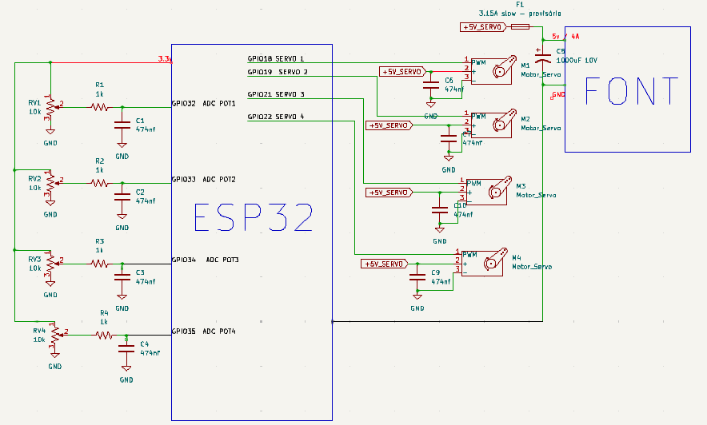

# Hardware

## Mapping

Connections:

| Actuator | Potentiometer | Servo |
| --- | --- | --- |
| Shoulder | GPIO 32 | GPIO 18 |
| Elbow | GPIO 33 | GPIO 19 |
| Hand | GPIO 34 | GPIO 21 |
| Claw | GPIO 35 | GPIO 22 |

## Power Supply and Notes

- Connect the outer terminals of the 10kΩ potentiometers to **3.3V** and **GND**. The potentiometer wiper is connected to the GPIO through a **low-pass filter**.
- The low-pass filter uses one **100 nF ceramic capacitor** and one **1 kΩ resistor**.
- **CAUTION:** Do not apply **5V** directly to the ESP32 ADC inputs.
- The servos are powered by a **5V power supply** capable of providing approximately **2A**.
- Connect all **GNDs** to a common ground. In my setup, I used the ESP32 GND as the common reference.
- Check the servo polarity before connecting it. If possible, do not power the circuit before confirming the polarity of the wires.
- Do not forget the **1000 µF electrolytic capacitor** on the servo power rail to help filter voltage fluctuations and electrical noise.
- The servo **VCC and GND** lines are connected in parallel with a **100 nF ceramic capacitor** to help reduce voltage spikes(but U can connect with similar values in the 100nF - 474nF range).
- To help protect the servos and the circuit from excessive current, it is good practice to use a **3A fuse** :).

## Schematics

  

